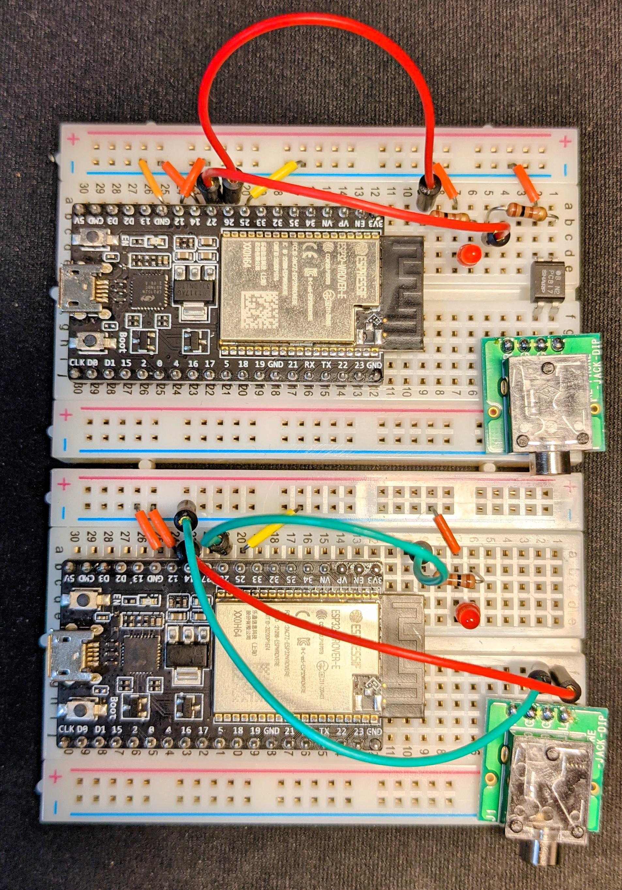

# WiFiKey
## はじめに
WiFiを使ってリモートからリグのキーイングを行う実験用システムです。
***
## ハードウェア  
エレキー・縦振電鍵・バグキー等にも対応できるようにするため入力側はHigh/Lowのレベル入力とします。キー側は入力されたレベルをWiFi経由でパケットにして送信します。リグ側では送られてきたパケットに格納されたレベルでフォトカプラを制御しリグのキーイングを行います。

システムは[ESP32](https://akizukidenshi.com/catalog/g/gM-15674/)を使って実装しています。キー側は`GPIO 14`を使ってキー入力を、リグ側は`GPIO 27`を使ってフォトカプラ[PC817](https://akizukidenshi.com/catalog/g/gI-13765/)を制御しています。(出力には電流制限用に100Ω程度の抵抗を入れてください)

またキーイング確認用のLED出力と動作設定用の入力にGPIOを割り当てています。

| GPIO | 入出力 | 機能 |
|:-----|:-------|:-----|
| 14 | 入力（内部プルアップ) | キー入力 |
| 26 | 出力 | LED出力 |
| 27 | 出力 | フォトカプラ用出力|
| 25 | 入力(内部プルアップ) | WiFiモード |
| 12 | 入力(内部プルアップ) | パケットタイプ |

***

## 動作モードの切り替え
### クライアント・サーバ
起動時にキー入力(`GPIO 14`)のレベルをみて動作モードを決めています。サーバ（リグ側）は`GPIO 14`を`L`に固定しています。サーバは後述するスタンドアロンモードの場合はWiFiのアクセスポイントとしても機能します。

起動時にキー入力(`GPIO 14`)が`H`になっている場合はクライアント(キー側)として動作します。

### WiFiモード
起動時に`GPIO 25`が`H`の場合はサーバーは既設のWiFIアクセスポイントへの接続を行います。SSID/パスワードはコード中に埋め込んでいます。サーバのアドレスは変数`server`のアドレスになります（デフォルト`192.168.1.192`）
クライアント(キー側)はアクセスポイントからDHCPで割り当てられたアドレスとなります。

`GPIO 25`が`L`の場合はサーバはスタンドアロンのWiFiのアクセスポイントとして動作します。サーバのアドレスは変数`gateway`のアドレスになります(デフォルト`192.168.4.1`)
クライアント（キー側）は変数`myip`のアドレス(デフォルト`192.168.4.2`となります。

### パケットタイプ
キー入力の立ち下がり・立ち上がりのエッジでUDPパケットを送出するエッジタイプ(起動時`GPIO 12`が`L`)と、キー入力の立ち上がりのタイミングでキーダウンされていた時間と送出時刻をUDPパケットで送出する時刻タイプ(起動時`GPIO 12`が`H`)があります。

[エッジタイプ](https://youtu.be/C8p-kPGs3-I)はレイテンシの少ないキーイングが可能です。しかしアクセスポイントを経由して接続するとパケットの到着時刻にジッタが生じてしまいサーバ側で符号を再現することができません。スタンドアローンモードでサーバにクライアントを直接繋ぐ場合にお使いください。

[時刻タイプ](https://youtu.be/Xg9ygcKnHZg)はキーダウンの時間と次の符号までの時刻を保存するためアクセスポイントを経由した場合でも符号の乱れがありません。しかしサーバ側でのバッファリングが必要になるためレイテンシが生じます。バッファーに何シンボル分溜まってから送出するか(`SYMBOLWAIT`)、規定シンボル数以下でも所定時間(`QLATENCY`)経過後に送出するか設定するパラメータがありますので適宜調節してください。

