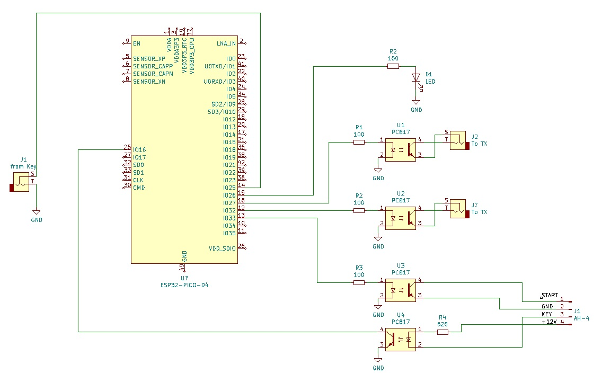
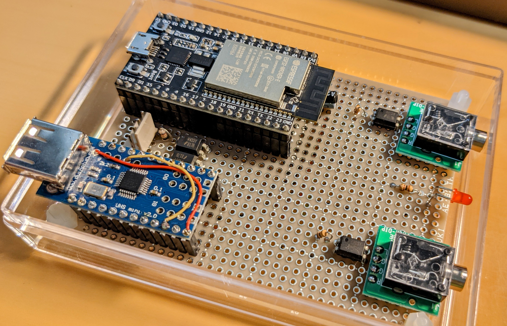

# WiFiKeyとは
最近のトランシーバはリモート接続の機能を持ったものがあり、PC等の接続が不要で直接外部からコントロールすることができます（IC-705,IC-9700など）。これらのトランシーバは専用クライアントソフトを使ってリモートからコントロールや音声による運用を行うことができますが、CW運用はキーボード入力に限定されてしまいます。

WiFiKeyはネットワークを介してリモートにあるトランシーバのキーイングを可能にします。手元のクライアントに縦振電鍵やエレキーを接続し打鍵すると、打鍵タイミングをネットワークを介してサーバに伝えサーバはそのタイミングに忠実にトランシーバのキーイングを行ないます。


***
# 使い方
## 初期設定
ソフトウェア編を参照して接続するWiFiネットワークのSSIDとパスワードを`config.json`に記載し、2台のM5ATOMLiteに書き込みます。次にサーバー（フォトカプラを積んだ側）を電源を接続してください。本体の緑色のランプが点灯し、アクセスポイントへの接続を始めます。接続が完了するとランプが消灯しますので、次に同じネットワークにあるPCから`http://wifikey.local`にアクセスして下さい。以下の設定画面が現れます。


次にボタン`Settings`を押すと以下の設定画面に移ります。


設定画面で`MODE`を`Server`に設定してください。次に接続するためのパスワードを`Password`欄に入力して下さい(`Retype`には確認用に同じパスワードを入れて下さい)。最後に`Save`ボタンを押して設定を保存してください。サーバー側の設定はひとまずこれで終わりですので電源を外してください。

次にクライアント（キーを接続する側）を電源に接続します。起動後同様に`http://wifikey.local`にアクセスしボタン`Setting`で設定画面に移ります。次にサーバと異なる名前をつけるため、`Name`に`wifikey-client`等の名前を設定します。`Password`はサーバ側に設定したものと同じものを入れてください。次に`Mode`を`Client`に設定すると`Server Name`の欄がアクティブになりますので最初に設定したサーバの名前を入れてください。こちらも最後に`Save`ボタンを押して設定を保存して終了してください。

## 使ってみよう
サーバ側をトランシーバのキー端子に、クライアント側を縦振電鍵/エレキーなどに接続します。まずサーバ側に電源を接続し緑色のランプが消灯するまで待ってください。次ににクライアント側の電源を入れてください（クライアントがネットワーク上でサーバを探すため先にサーバの電源を入れておく必要あります）。

キーを打鍵すると少し遅れたタイミングでトランシーバがキーイングされます。サーバ側`http://wifikey.local`にアクセスすると以下の画面が現れます。


各項目の詳細は以下の通りです。

|項目名 | 意味　|
|:------|:----------|
|Name | ホスト名(IPアドレス)|
|Mode | 稼働中のモード(`Server`または`Client`)|
|Client| 接続中のクライアントのアドレス・ポート|
|Timeout|タイムアウトするまでの時間(デフォルトは30分)|
|Estimated Speed|推定キーイング速度 (WPM)|
|Estimated Dash Dot Ratio|長点・短点の比|
|Packet Error|パケットがロストした数|
|Packet Delay|パケットが到達するまでに要する時間|
|Max queue length| サーバのキューの最大長|
|Max long mark duration| 最も長い長点の長さ|
|Space duration| 符号間のスペースの長さ|

`Packet Error`は受信時にパケットがロスした場合にカウントされます。`Packet Delay`とは符号パケットの到着時刻の間隔からキー入力時の符号間の間隔を引いたもので、この値が大きいほどネットワーク等の遅延が大きいことを表します。

## 高度な使い方
### サーバ・クライアントを直接接続する
屋外など接続可能なWiFi環境が無い場合にはサーバをアクセスポイントとしてクライアントを直接接続することができます。

まずサーバの設定画面で`WiFi`を`Access Point`に設定してください。次にアクセスポイントのSSID/パスワードを設定するために、`Access Point`の`SSID`,`Password`を設定します。最後にサーバのアドレス・ポートをを`Local`に設定してください。`Save`で設定を保存してください。再び設定画面で`REBOOT`ボタンを押すとシステムが再起動し設定が有効になります。

次にクライアント側を設定します。サーバと同様`WiFI`を`Access Point`に設定し`SSID`,`Password`をサーバで設定したものと同じ値を入力します。次に先程設定したサーバのアドレス・ポートを`Local`に設定してください。最後に`Save`で設定を保存します。サーバと同様再起動すると設定が有効になり、直接サーバに接続されます。

尚、設定画面を開く場合にはPCなどからサーバのアクセスポイントに接続してください。名前によるアクセスができない場合は`http://192.168.4.1/`などサーバのIPアドレスを直接入力して下さい。

### 複数のSSIDの登録
クライアントをモバイルルータや自宅以外のWiFi環境に接続する場合はSSID2/SSID3に接続するWiFiのSSID/パスワードを追加登録してください。起動時は一番電波の強いSSIDのアクセスポイントへの接続を試みます。

### パケットタイプの切り替え
`Keyer Parameter`の`Packet`でキーイングを行うタイミングを変更することができます。

タイミングには、キー入力の立ち下がり・立ち上がりのエッジでパケットを送出するエッジタイプ`Edge`と、キー入力の立ち上がりのタイミングでキーダウンされていた時間と送出時刻をパケットで送出する時刻タイプ`Time`の2種類があります。

エッジタイプは遅れの少ないキーイングが可能です。しかしステーションモードで既設のWiFiアクセスポイントを経由して接続するとパケットの到着時刻にジッタでてしまうためサーバ側で正確な符号を再現することができません。サーバとクライアントを直接繋ぐアクセスポイントモードで使うようにしてください。

時刻タイプはキーダウンの時間と次の符号までの時刻を保存するためアクセスポイントを経由した場合でも符号の乱れがありません。しかしサーバ側でのバッファリングが必要になるためレイテンシが生じます。バッファーに何シンボル分溜まってから送出するか設定するパラメータ`Symbol`、規定シンボル数以下でも以下の式で求められる所定時間`T` msec経過後に送出を設定するパラメータ`Latency`としてがありますのでネットワーク環境や運用スタイルに合わせて最適な値を設定してください。

```
 T = (長点の長さ(ms) + 符号間の間隔(ms)) * Latency
```

尚、本パラメータはサーバ・クライアント双方で行うことができます。クライアント側でパラメータ設定をするとサーバ側にも値が送られ自動的に設定されます。

### 外部のネットワークからの接続
自宅内のネットワークにあるサーバにモバイルルータ等を経由して外部のネットワークにあるクライアントからアクセスすることができます。

まずクライアントの設定の設定画面で`Server Address`の`Global`に自宅ネットワークのルータのグローバルアドレス及びアクセス可能なポートを指定してください。グローバルアドレスの指定にダイナミックDNSを使っている場合はホスト名を指定してください。
クライアントが起動されるとマルチキャストDNSを使ってローカルネットワーク内で`'Server Name'.local`を探します。ローカルネットワークでサーバが見つからない場合は`Global`で指定されたアドレスへのアクセスを行ないます。

次にDHCPでサーバに設定されるアドレスを固定します。サーバのMACのアドレスを調べ、固定アドレスが振られるようにルータのDHCPサーバに登録してください。

次にルータのポートフォワーディングの設定でグローバルアドレスのポートを、DHCPからサーバに振られるアドレスのポート(`Server Address`の`Local`のポート部分)にフォワードするように設定してください。

***
# ハードウェア編
## 必要な部品

1. ESP32を搭載したボード ([ESP32-WROOM](https://akizukidenshi.com/catalog/g/gM-15675/)や[M5 AtomLite](https://www.switch-science.com/catalog/6262/)など) 　x2
2. フォトカプラ[PC817](https://akizukidenshi.com/catalog/g/gI-13765/) x1
3. LED x2
4. 抵抗 100Ω (フォトカプラ・LEDの電流制限用) x3
5. ジャック（電鍵・トランシーバ接続用) x2
6. ブレッドボード等 x 2

## 回路構成
クライアント側は`GPIO 14`をキー入力として使います。トランシーバ側は`GPIO 27`を出力をフォトカプラ接続しトランシーバをキーイングします。またクライアント・サーバ共に動作確認のLEDを`GPIO 26`に接続しています。

GPIOの入力は全てESP32内部でプルアップしています。また出力側には電流制限用に100Ωの抵抗を入れています(GPIOの出力を直接フォトカプラやLEDに接続しないでください)。尚、評価ボードによっては書込時にタイミングの問題で失敗するものがありますが、EN-GND間に1uF程度のコンデンサを入れると改善するようです。

| GPIO | 入出力 | 機能 |
|:-----|:-------|:-----|
| 14 | 入力（内部プルアップ) | キー入力 |
| 26 | 出力 | LED出力 |
| 27 | 出力 | フォトカプラ用出力|

以下に回路図を示します（便宜上サーバ・クライアントの双方を同じ図面に載せています）


以下の写真は[ESP32-WROVER](https://akizukidenshi.com/catalog/g/gM-15674/)とブレッドボードを使った制作例です。上側がサーバ、下側がクライアントになります。


スケッチはM5ATOMLiteも対応しています。`Board Config`を`M5Stack-ATOM`でコンパイルすると以下のGPIOに入出力がアサインされます。

| GPIO | 入出力 | 機能 |
|:-----|:-------|:-----|
| 19 | 入力（内部プルアップ) | キー入力 |
| 27 | 出力 | LED出力 |
| 23 | 出力 | フォトカプラ用出力|

またWiFi接続判定用にM5ATOMLite本体のLEDを使っています。

***
# ソフトウェア編
## 事前準備
Arduino IDEのボードマネージャを使って使用するボードを追加してください(esp32で検索できます）。ライブラリとしてArduinoJSONを使っていますのでこちらもライブラリマネージャを使ってインストールしてください。ESP32は内部にファイルシステムを持っておりバイナリファイルの書き込みとは別にファイルアップロード用のモジュールESP Sketch Data Uploadを使います。[こちら](https://www.ei.tohoku.ac.jp/xkozima/lab/espTutorial5.html)を参考に追加してください。

## 設定ファイルの修正
WiFiKeyは最初の起動時に`config.json`を読み込みWiFiへの接続を行ないます。利用する環境によって以下の設定を変更してください。
| パラメータ | 初期値 | 意味 |
|:-----|:-------|:-----|
|version|"0.00" |バージョン番号　起動時にNVMに保存されたバージョンとバージョンが異なる場合はconfig.jsonを優先して読み込みます|
| keyername | "wifikey" |ホスト名　mDNSの名称として使われます|
| keyerpasswd | "passwd" |クライアント識別用パスワード |
| servermode| "%checked%"|サーバモード　`%checked%`の場合サーバとして起動|
| servername| "wifikey" | サーバ名 |
| wifistn | %checked% | WiFiモード　`%checked%`の場合WiFiステーションとして起動|
| SSID1| - | ステーション時のSSID1 |
| passwd1| - | SSID1のパスワード |
| SSID2| -| ステーション時のSSID2 |
| passwd2| - | SSID2のパスワード
| SSID3| -| ステーション時のSSID3 |
| passwd3| - | SSID3のパスワード
| APSSID| -| アクセスポイント時のSSID |
| passwd3| - | アクセスポイント時のパスワード|
| pkttypetime|%checked%|パケットタイプ `%checked%`の場合`Time`で起動|
| localaddr|192.168.1.192|サーバローカルアドレス|
| localport|56000|サーバローカルアドレスのポート|
| globaladdr|192.168.1.192|サーバグローバルアドレス(FQDNで入力可)|
| globalport|56001|サーバグローバルポート|
| latency |2| レイテンシ| 
| symbol |2| シンボルウェイト|

## スケッチ・データのアップロード
githubから一式をダウンロードした後、ソースと同じディレクトリにdataフォルダを置いてください。Arduino IDEでコンパイル・書き込み完了後にESP Skecth Data Uploadを起動するとdataフォルダ以下がESP32のルートディレクトリ以下にアップロードされます。
