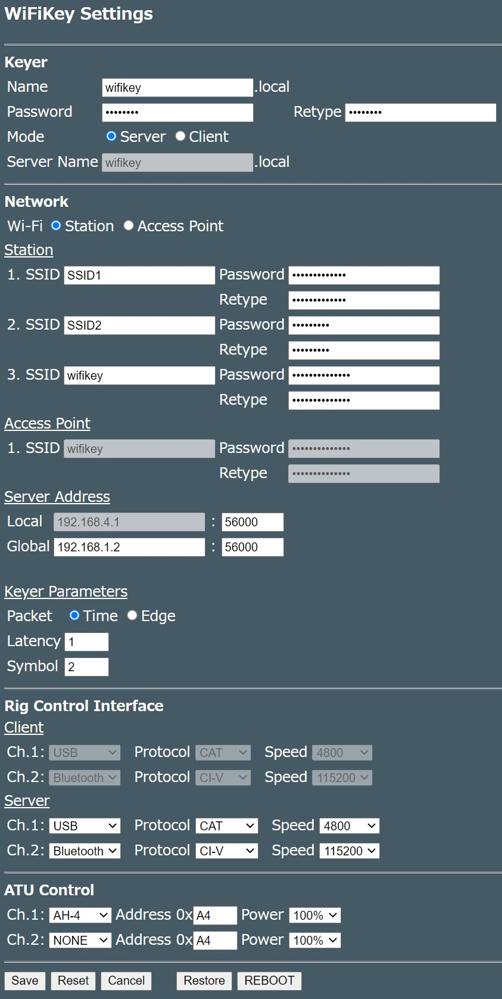

# WiFiKeyとは
最近のトランシーバはリモート接続の機能を持ったものがあり、PCなどに接続せず直接外部からコントロールできます(IC-705,IC-9700など)。これらのトランシーバは専用クライアントソフトを使ってリモートからコントロールや音声による運用ができますが、CW運用はキーボード入力に限定されてしまいます。

WiFiKeyはネットワークを介してリモートにあるトランシーバのキーイングを可能にします。手元のクライアントに縦振電鍵やエレキーを接続し打鍵すると、打鍵タイミングをネットワークを介してサーバーに伝えサーバーはそのタイミングに忠実にトランシーバのキーイングを行います。

またIC-705向けにCI-Vインタフェースをリモート制御する機能を持っています。Blutoothを使ってトランシーバとサーバと接続し、ネットワークを介してクライアントを接続したPCからCI-Vコントロールします。これにより手元のPCでログソフトを直接操作できます。


***
# 使い方
## 初期設定
ハードウェア編を参考にサーバー・クライアントの2台を組み立ててください。次にソフトウェア編を参考にインストーラを使ってファームウェアを書き込みます。ファームウェア書き込み後、サーバー(フォトカプラを積んだ側)に電源を接続してください。本体の緑色のランプが一瞬点灯しアクセスポイントとして稼働します。SSID `WiFiKey` パスワード `password` でアクセスポイントに接続後、`http://192.168.4.1/`にアクセスすると以下の表示が現れます。


次にボタン`Settings`を押すと以下の設定画面に移ります。



設定画面で`MODE`を`Server`に設定してください。次に接続するためのパスワードを`Password`欄に入力してください(`Retype`には確認用に同じパスワードを入れてください)。Wi-Fiステーションとして既設のWi-Fi環境に接続する場合は`Station`の`SSID` `Password`を入力してください。最後に`Save`ボタンを保存して終了です。

次にクライアント(キーを接続する側)を電源に接続しサーバーと同様に設定画面を開きます。サーバーと異なる名前をつけるため、`Name`に`wifikey-client`などの名前を設定します。`Password`はサーバー側に設定したものと同じものを入れてください。次に`Mode`を`Client`に設定すると`Server Name`の欄がアクティブになるので最初に設定したサーバーの名前を入れてください。Wi-Fi設定もサーバーと同様です。こちらも最後に`Save`ボタンを押して設定を保存して終了してください。

## 使ってみよう
サーバー側をトランシーバのキー端子に、クライアント側を縦振電鍵/エレキーなどに接続します。まずサーバー側に電源を接続し緑色のランプが消灯するまで待ってください。次にクライアント側の電源を入れてください（クライアントがネットワーク上でサーバーを探すため先にサーバーの電源を入れておく必要あります）。

キーを打鍵すると少し遅れたタイミングでトランシーバがキーイングされます。サーバー側`http://wifikey.local`にアクセスすると以下の画面が現れます。


各項目の詳細は以下の通りです。

|項目名 | 意味　|
|:------|:----------|
|Name | ホスト名(IPアドレス)|
|Mode | 稼働中のモード(`Server`または`Client`)|
|Client| 接続中のクライアントのアドレス・ポート|
|Timeout|タイムアウトするまでの時間(デフォルトは30分)|
|Estimated Speed|推定キーイング速度 (WPM)|
|Estimated Dash Dot Ratio|長点・短点の比|
|Packet Error|パケットがロストした数|
|Packet Delay|パケットが到達するまでに要する時間|
|Max queue length| サーバーのキューの最大長|
|Max long mark duration| 最も長い長点の長さ|
|Space duration| 符号間のスペースの長さ|

`Packet Error`は受信時にパケットがロスした場合にカウントされます。`Packet Delay`とは符号パケットの到着時刻の間隔からキー入力時の符号間の間隔を引いたもので、この値が大きいほどネットワークの遅延が大きいことを表します。

## 高度な使い方
### サーバー・クライアントを直接接続する
屋外など接続可能なWi-Fi環境がない場合にはサーバーをアクセスポイントとしてクライアントを直接接続できます。

まずサーバーの設定画面で`Wi-Fi`を`Access Point`に設定してください。次にアクセスポイントのSSID/パスワードを設定するために、`Access Point`の`SSID`,`Password`を設定します。最後にサーバーのアドレス・ポートをを`Local`に設定してください。`Save`で設定を保存してください。再び設定画面で`REBOOT`ボタンを押すとシステムが再起動し設定が有効になります。

次にクライアント側を設定します。サーバーと同様`WiFI`を`Access Point`に設定し`SSID`,`Password`をサーバーで設定したものと同じ値を入力します。次に先程設定したサーバーのアドレス・ポートを`Local`に設定してください。最後に`Save`で設定を保存します。サーバーと同様再起動すると設定が有効になり、直接サーバーに接続されます。

### 複数のSSIDの登録
クライアントをモバイルルーターや自宅以外のWi-Fi環境に接続する場合はSSID2/SSID3に接続するWi-FiのSSID/パスワードを追加登録してください。起動時は一番電波の強いSSIDのアクセスポイントへの接続を試みます。

### パケットタイプの切り替え
`Keyer Parameter`の`Packet`でキーイングを行うタイミングを変更できます。

タイミングには、キー入力の立ち下がり・立ち上がりのエッジでパケットを送出するエッジタイプ`Edge`と、キー入力の立ち上がりのタイミングでキーダウンされていた時間と送出時刻をパケットで送出する時刻タイプ`Time`の2種類があります。

エッジタイプは遅れの少ないキーイングが可能です。しかしステーションモードで既設のWi-Fiアクセスポイントを経由して接続するとパケットの到着時刻にジッタでてしまうためサーバー側で正確な符号を再現できません。サーバーとクライアントを直接接続するアクセスポイントモードで使うようにしてください。

時刻タイプはキーダウンの時間と次の符号までの時刻を保存するためアクセスポイントを経由した場合でも符号の乱れがありません。しかしサーバー側でのバッファリングが必要になるためレイテンシが生じます。バッファーに何シンボル分溜まってから送出するか設定するパラメータ`Symbol`、規定シンボル数以下でも以下の式で求められる所定時間`T` msec経過後に送出を設定するパラメータ`Latency`としてがありますのでネットワーク環境や運用スタイルに合わせて最適な値を設定してください。

```
 T = (長点の長さ(ms) + 符号間の間隔(ms)) * Latency
```

なお、本パラメータはサーバー・クライアント双方で設定することができます。クライアント側でパラメータ設定をするとサーバー側にも値が送られ設定されます。

### 外部のネットワークからの接続
自宅内のネットワークにあるサーバーにモバイルルーターなどを経由して外部のネットワークにあるクライアントからアクセスできます。

まずクライアントの設定の設定画面で`Server Address`の`Global`に自宅ネットワークのルーターのグローバルアドレス及びアクセス可能なポートを指定してください。グローバルアドレスの指定にダイナミックDNSを使っている場合はホスト名を指定してください。なお、クライアントは起動時にマルチキャストDNSを使ってローカルネットワーク内で`'Server Name'.local`が存在するか確認します。サーバーが見つからない場合は`Global`で指定されたアドレスへのアクセスを行います。

次にDHCPでサーバーに設定されるアドレスを固定します。サーバーのMACのアドレスを調べ、固定アドレスが振られるようにルーターのDHCPサーバーに登録してください。

次にルーターのポートフォワーディングの設定でグローバルアドレスのポートを、DHCPからサーバーに振られるアドレスのポート(`Server Address`の`Local`のポート部分)にフォワードするように設定してください。

### CI-Vコントロールのリモート化
IC-705はBlutoothによるCI-Vコントロールができます。WiFiKeyのサーバをIC-705とペアリングすることでクライアントを接続したPCからリモートでCI-Vコントロールをすることができます。
#### 設定方法
サーバーで`Bluetooth CI-V`を`Enable`にします。IC-705の設定画面を開くとサーバー名のデバイスが表示されますのでペアリングしてください。次にクライアントの`Bluetooth CI-V`を`Enable`にしシリアルポートの速度を設定します。クライアントをPCに接続するとCOMポートが現れますので、ログソフトなどでCI-V用ポートとして指定してください。サーバーに接続したIC-705をリモートで制御することができます。

Ctestwin/WSJT-X/Logger32/DXLab. Commanderなどで動作確認済みです。なおTurboHAMLOGでは使用できません。シリアルポートアクセス時にESP32がハングアップします。万が一ハングアップした場合は電源を外してください。原因は不明ですがDTR/RTSのタイミングでEPS32がプログラムモードに入ってしまうのではないかと思われます。

***
# ハードウェア編
## 必要な部品

1. ESP32を搭載したボード ([ESP32-WROOM](https://akizukidenshi.com/catalog/g/gM-15675/)や[M5 AtomLite](https://www.switch-science.com/catalog/6262/)など) 　x2
2. フォトカプラ[PC817](https://akizukidenshi.com/catalog/g/gI-13765/) x1
3. LED x2
4. 抵抗 100Ω (フォトカプラ・LEDの電流制限用) x3
5. ジャック（電鍵・トランシーバ接続用) x2
6. ブレッドボードなど x 2

## 回路構成
以下に回路図を示します。便宜上サーバー・クライアントの双方を同じ図面に載せています。
使用するプラットフォームによってピンアサインが異なりますので注意してください。


### M5ATOM
[M5ATOMLite](https://www.switch-science.com/catalog/6262/)と[ATOMICプロトキット](https://www.switch-science.com/catalog/6345/)を使って製作しています。


ビルドの際に`m5stack-atom`を選択してコンパイルするとGPIOのアサインが以下のように設定されます。

| GPIO | 入出力 | 機能 |
|:-----|:-------|:-----|
| 19 | 入力（内部プルアップ) | キー入力 |
| 27 | 出力 | LED出力 |
| 23 | 出力 | フォトカプラ用出力|

### ESP32-WROVER
以下の写真は[ESP32-WROVER](https://akizukidenshi.com/catalog/g/gM-15674/)とブレッドボードを使った制作例です。上側がサーバー、下側がクライアントです。


クライアント側は`GPIO 25`をキー入力として使います。トランシーバ側は`GPIO 27`を出力をフォトカプラ接続しトランシーバをキーイングします。またクライアント・サーバーともに動作確認のLEDを`GPIO 26`に接続しています。

GPIOの入力は全てESP32内部でプルアップしています。また出力側には電流制限用に100Ωの抵抗を入れています(GPIOの出力を直接フォトカプラやLEDに接続しないでください)。なお、評価ボードによっては書込時にタイミングの問題で失敗するものがありますが、EN-GND間に1uF程度のコンデンサを入れると改善するようです。

| GPIO | 入出力 | 機能 |
|:-----|:-------|:-----|
| 25 | 入力（内部プルアップ）| キー入力 |
| 26 | 出力 | LED出力 |
| 27 | 出力 | フォトカプラ用出力|

***
# ソフトウェア編
## インストーラによるファームウェア書き込み
[インストーラ](https://drive.google.com/file/d/1Zjf8e5hIttzFD8ksBbR22XFTYwXDYqD4/view?usp=sharing)をダウンロードしZIPファイルを展開後、`install.bat`を起動してください。ボードを接続したCOMポートを指定しボードに対応するファームウェアを書き込んでください。次にファイルシステム（ボード共通）を書き込んでください。以上でインストールは完了です。


## 設定ファイル
WiFiKeyに起動時にNVMに保存されたバージョンと`config.json`のバージョンが異なる場合、以下の設定内容をNVMに読み込みます。画面で設定変更した際に各項目で設定が更新されるタイミングが異なりますので注意してください。

| パラメータ | 初期値 | 意味 |更新タイミング|
|:----------|:-------|:-----|:------------------|
|version|"1.01" |バージョン番号　起動時にNVMに保存されたバージョンとバージョンが異なる場合はconfig.jsonを優先して読み込みます|-|
| keyername | "wifikey" |ホスト名　mDNSの名称として使われます|リブート後|
| keyerpasswd | "passwd" |接続パスワード |設定変更後|
| servermode| "%checked%"|サーバーモード　`%checked%`の場合サーバーとして起動|〃|
| servername| "wifikey" | サーバー名 |設定変更後|
|enablebt| "%checked%"| Bluetooth機能　`%checked%`で起動(サーバーのみ) |〃|
|baudrate| 115200 | シリアル接続の速度 |〃|
| wifistn | %notchecked% | Wi-Fiモード　`%checked%`の場合Wi-Fiステーションとして起動|リブート後|
| SSID1| - | ステーション時のSSID1 |〃|
| passwd1| - | SSID1のパスワード |〃|
| SSID2| -| ステーション時のSSID2 |〃|
| passwd2| - | SSID2のパスワード|〃|
| SSID3| -| ステーション時のSSID3 |〃|
| passwd3| - | SSID3のパスワード|〃|
| APSSID| -| アクセスポイント時のSSID |〃|
| passwdap| - | アクセスポイント時のパスワード|〃|
| pkttypetime|%checked%|パケットタイプ `%checked%`の場合`Time`で起動|設定変更後|
| localaddr|192.168.4.1|サーバーローカルアドレス|リブート後|
| localport|56000|サーバーローカルアドレスのポート|〃|
| globaladdr|192.168.4.1|サーバーグローバルアドレス(FQDNで入力可)|〃|
| globalport|56000|サーバーグローバルポート|〃|
| latency |2| レイテンシ| 設定変更後|
| symbol |2| シンボルウェイト|〃|

## 開発環境について
Visual Studio CodeとPlatformIOを使っています。GitHubからZIPファイルを展開後、`Add Project`で追加してください。 また外部ライブラリとしてArduinoJSON・FastLEDを使っています。自動でインストールされない場合は`PIO Home`の`Libraries`から検索してインストールしてください。
次に`Project Environment`でボードを選択してビルド後アップロードをします。最後に`data`フォルダーにある設定画面のHTMLファイル・設定ファイルを`Platoform`の`Upload Filesystem Image`を使ってアップロードして完了です。